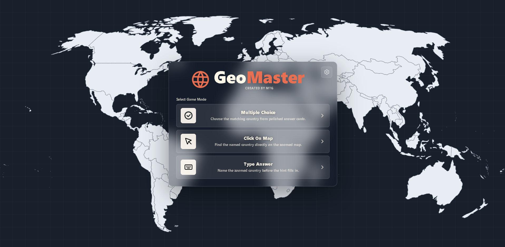

# GeoMaster

**Live demo:** [https://mtg1461.github.io/geo-master/](https://mtg1461.github.io/geo-master/)
GeoMaster is a lightweight browser-based geography game hub built around an interactive SVG world map. Players can test their country knowledge through multiple game modes, timed rounds, responsive map zooming, score tracking, and polished audio-visual feedback.

## Game Modes

- **Multiple Choice**: Choose the correct country from polished answer cards.
- **Type Answer**: Type the name of the zoomed-in country before the hints reveal too much.
- **Click on Map**: Find and click the requested country directly on the map.

## Features

- Seeded rounds for reproducible gameplay.
- Difficulty-based country pools and scoring.
- Smooth SVG map zooming, highlighting, and click detection.
- Timed modes with animated countdown feedback.
- Local top-five scoreboard per game mode.
- Responsive desktop and mobile layouts.
- Button, timer, transition, answer, and game-end sound effects.

## Engineering Highlights

- Modular game-mode architecture.
- Deterministic seeded randomization.
- Difficulty-based content selection.
- Interactive inline SVG map engine.
- Camera and transition system.
- Performance-focused animation optimizations.
- Mode-specific UI adapters.
- Scoreboard persistence.
- Responsive interface design.
- Categorized sound feedback.
- Cleanup for timers, handlers, transitions, and effects.
